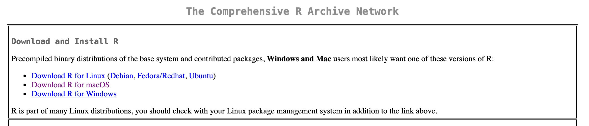

```{r setup, include=FALSE}
library(learnr)
library(knitr)
knitr::opts_chunk$set(echo = FALSE)
```

Attempt this tutorial before the first day of class. If you get stuck, we will provide in-class help.

Only the first section of this tutorial is required. The rest is optional, depending on your module.

## Required Steps to Install R {#section-install}

This file has instructions for getting set up in R before class starts.

1. Install R

- Go to R download page
- Choose the appropriate version for your computer (Windows, Mac, or Linux)

```{r, out.width='90%'}

```

- If on Windows, next select the `base` subdirectory, which will automatically select the appropriate version for your system.
- If on Mac, next select the appropriate version for your hardware (M-series chip or Intel chip)
- Open downloaded file and run
- Install, accepting defaults

2. Install RStudio

- RStudio is an interface for R
- go to RStudio download page from Posit
- Download RStudio Desktop
- Open downloaded file and run
- Install, accepting defaults

3. Make sure you can open R Studio

4. Quit RStudio

You are now ready to come to class.

## Optional: Install Quarto

The remaining steps describe how to create a document that can show your code, the code’s output and your narration or discussion of the code and its output. This type of document is generally called a “markdown” document.

There has just been a big upgrade in R’s ability to create these type of documents, via a new option called [quarto](https://quarto.org/).

Quarto allows you to produce outputs in many different formats, including the pdf that you will need to do for your homework.

However, the start-up costs of learning quarto are high. Therefore, I encourage this option only if you already feel comfortable with R, or if you feel comfortable with programming. If this is your first time programming, I don’t recommend trying this till much later in the semester, if at all.

All that said, to install quarto, you need to do the following (see fuller version of these instructions [here](https://quarto.org/docs/get-started/hello/rstudio.html))

- Open R Studio (making sure you have at least v2022.07)
- Install three packages – tidyverse, rmarkdown, and palmerpenguins. To do so, at the console window, type
```r
install.packages("tidyverse")
install.packages("rmarkdown")
install.packages("palmerpenguins")
```

- Make a quarto project by going to file New project Quarto [whatever kind of project you want]
- Fill in the document as needed

## Additional Resources

Dr Antoine Vernet has produced a helpful video on how to install R and RStudio if you need further help. You can find it [here](https://elevate.talis.com/ucl/player/modules/614c879d6d2933297e9553cd/media/61d5c3f55f8d6a73d6cbb92b).
